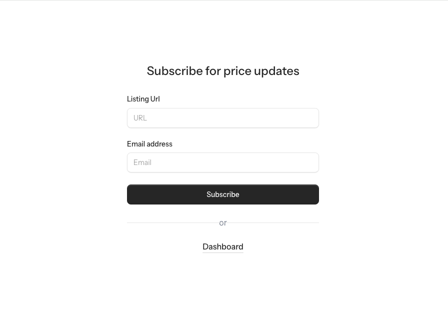
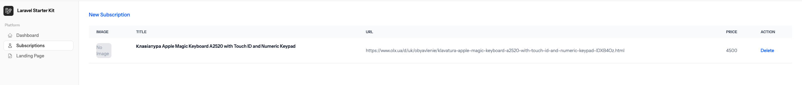
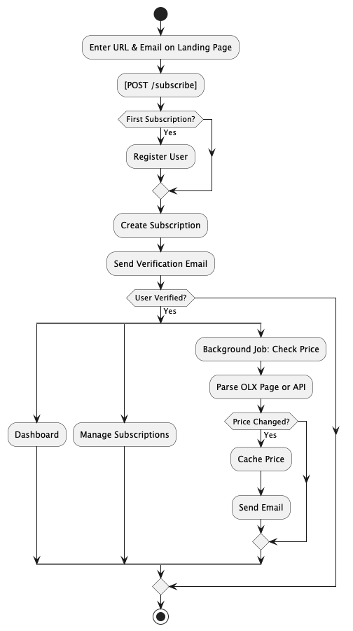

## Price Monitor Service

### Project description

The Price Monitor is a Laravel 12-based web service allowing users to subscribe to OLX listing price changes by submitting a URL and email, accessible via an HTTP method without requiring login or authentication. 
New users are registered and subscribed instantly but remain unverified until email confirmation. Price monitoring and email notifications are processed only for verified users. 
The dashboard and subscription management available for verified authenticated users.

### Supported sources
 - OLX.ua

### Steps to Run the Service

1. **Clone the project**
   ```bash
   git clone https://github.com/kapver/price-monitor.git
   ```

2. **Navigate to the project directory**
   ```bash
   cd price-monitor
   ```

3. **Install dependencies and start the service**
   ```bash
   chmod +x ./install.sh && ./install.sh
   ```

4. **Preview the application**  
   Open your browser and navigate to:  
   [http://127.0.0.1:8001](http://127.0.0.1:8001)


5. **Subscribe Page**
   For unauthorized users
   [http://127.0.0.1:8001/user/subscriptions](http://127.0.0.1:8001/user/settings)
   


5. **Manage Subscriptions**  
   You can configure your preferred weather conditions and notification settings by navigating to:  
   [http://127.0.0.1:8001/user/subscriptions](http://127.0.0.1:8001/user/settings)
   


6. **Check Emails Sent with Mailpit**  
   You can view any emails sent by the service by navigating to:  
   [http://localhost:8025/](http://localhost:8025/)


7. **Test User Account:**  
You can log in using the following credentials:

- **Email:** test@weather.io
- **Password:** 111

> **Note:** The host machine is assumed to lack PHP and Composer, so a workaround is implemented under the hood.

### Flowchart Diagram



---

Tested on **macOS 15.3.1**